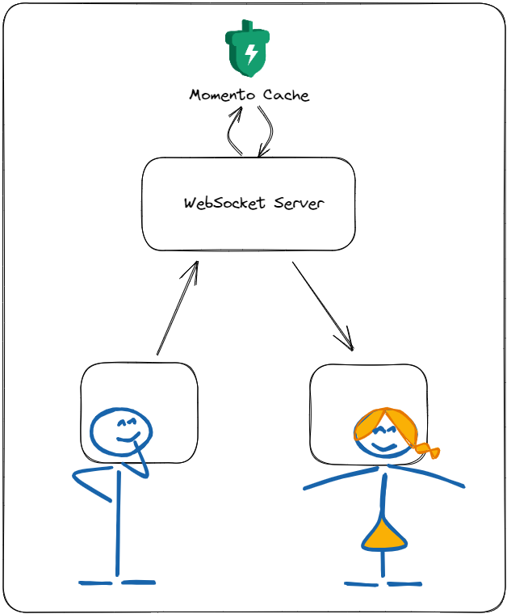

# Momento Use Cases - Instant Messaging

Momento Cache is a powerful, serverless caching solution that is a great choice for instant messaging applications. By providing a temporary data store for saving and retrieving messages, it enables low-latency communication and enhances the user experience across various industries.

## Overview

Instant messaging applications require rapid access to messages and associated metadata, often under heavy traffic loads. Momento Cache offers a serverless caching solution that ensures high performance and low latency while eliminating infrastructure costs and minimizing configuration. Momento Cache enables messages to be saved and retrieved quickly, providing an excellent experience for users.

## Industries

Instant messaging is a staple in a wide range of industries that rely on real-time communication, including:

1. **Customer Support:** Improve response times in live chat support systems, providing customers with a seamless experience.
2. **Collaboration Tools:** Enhance collaboration within teams by facilitating real-time communication in project management tools and shared workspaces.
3. **Gaming:** Enable in-game chats and messaging systems that require low-latency communication between players.
4. **Social Media:** Power instant messaging features in social networking platforms, allowing users to chat without delays.
5. **Healthcare:** Facilitate secure, real-time communication between healthcare professionals and patients.

Using a temporary data store like Momento Cache offers several advantages:

- **Performance:** By storing messages in a cache, Momento Cache reduces response times and ensures that users can access messages almost instantaneously.
- **Scalability:** As a serverless solution, Momento Cache automatically scales to handle fluctuations in traffic, accommodating both small-scale and large-scale applications.
- **Cost-efficiency:** With its pay-as-you-go pricing model, Momento Cache eliminates the need for expensive infrastructure investments and reduces ongoing maintenance costs.
- **Security:** Momento Cache stores messages temporarily, minimizing the risk of unauthorized access to sensitive data.
- **Flexibility:** Momento Cache integrates seamlessly with various messaging protocols and platforms, allowing you to easily adapt it to your specific use case.
- **Automatic Expiration:** All data sent to Momento is configured with a Time to Live (TTL). When the TTL expires, the data is permanently deleted. No need to handle cleanup yourself - we have you covered.

## Code Samples

### Saving a message to the chat history

Node.js

<pre><code class="language-javascript">
const CACHE_NAME = 'chat';
async function saveMessage(chatId, username, message){
  const chatMessage = JSON.stringify({username, message});
  await cacheClient.listPushBack(CACHE_NAME, chatId, chatMessage);
}
</pre></code>

Python

<pre><code class="language-python">
import json

CACHE_NAME = 'chat'
async def save_message(chat_id, username, message):
    chat_message = json.dumps({'username': username, 'message': message})
    cache_client.list_push_back(CACHE_NAME, chat_id, chat_message)

</pre></code>

Go

<pre><code class="language-go">
import "encoding/json"

const CACHE_NAME = "chat"
async func saveMessage(chatId, username, message) {
  chatMessage, _ := json.Marshal(map[string]string{"username": username, "message": message})
  _, err := cacheClient.ListPushBack(CACHE_NAME, chatId, string(chatMessage))
}

</pre></code>

Java

<pre><code class="language-java">
import com.fasterxml.jackson.databind.ObjectMapper;

final String CACHE_NAME = "chat";
async void saveMessage(String chatId, String username, String message) throws Exception {
  ObjectMapper objectMapper = new ObjectMapper();
  String chatMessage = objectMapper.writeValueAsString(Map.of("username", username, "message", message));
  await cacheClient.listPushBack(CACHE_NAME, chatId, chatMessage);
}
</pre></code>

.NET

<pre><code class="language-dotnet">
using System.Text.Json;

const string CACHE_NAME = "chat";
async Task SaveMessage(string chatId, string username, string message) {
    var chatMessage = JsonSerializer.Serialize(new {username, message});
    await cacheClient.ListPushBackAsync(CACHE_NAME, chatId, chatMessage);
}
</pre></code>

PHP

<pre><code class="language-php">
<?php
const CACHE_NAME = 'chat';
async function save_message($chat_id, $username, $message) {
    $chat_message = json_encode(['username' => $username, 'message' => $message]);
    await $cache_client->listPushBack(CACHE_NAME, $chat_id, $chat_message);
}
?>
</pre></code>

Ruby

<pre><code class="language-ruby">
require 'json'

CACHE_NAME = 'chat'
async def save_message(chat_id, username, message)
  chat_message = { username: username, message: message }.to_json
  cache_client.list_push_back(CACHE_NAME, chat_id, chat_message)
end

</pre></code>

Rust

<pre><code class="language-rust">
use serde::Serialize;

const CACHE_NAME: &str = "chat";
async fn save_message(chat_id: &str, username: &str, message: &str) {
    let chat_message = serde_json::to_string(&ChatMessage { username, message }).unwrap();
    cache_client.list_push_back(CACHE_NAME, chat_id, chat_message).await;
}

#[derive(Serialize)]
struct ChatMessage<'a> {
    username: &'a str,
    message: &'a str,
}
</pre></code>

### Fetching all messages from chat history

Node.js

<pre><code class="language-javascript">
const CACHE_NAME = 'chat';
async function getChatHistory(chatId){  
  let chatHistory = [];
  const response = await cacheClient.listFetch(CACHE_NAME, chatId);
  if(!response.is_miss){
    chatHistory = response.valueListString().map(m => JSON.parse(m));
  }
  return chatHistory;
}
</pre></code>

Python

<pre><code class="language-python">
import json

CACHE_NAME = 'chat'
async def get_chat_history(chat_id):
    chat_history = []
    response = cache_client.list_fetch(CACHE_NAME, chat_id)
    if not response.is_miss:
        chat_history = [json.loads(m) for m in response.value_list_string()]
    return chat_history

</pre></code>

Go

<pre><code class="language-go">
import "encoding/json"

const CACHE_NAME = "chat"
async func getChatHistory(chatId) {
  chatHistory := make([]map[string]string, 0)
  response, _ := cacheClient.ListFetch(CACHE_NAME, chatId)
  if !response.IsMiss() {
    valueListString := response.ValueListString()
    for _, m := range valueListString {
      var message map[string]string
      json.Unmarshal([]byte(m), &message)
      chatHistory = append(chatHistory, message)
    }
  }
  return chatHistory
}
</pre></code>

Java

<pre><code class="language-java">
import com.fasterxml.jackson.databind.ObjectMapper;
import java.util.ArrayList;
import java.util.List;
import java.util.Map;
import java.util.stream.Collectors;

final String CACHE_NAME = "chat";
async List<Map<String, String>> getChatHistory(String chatId) throws Exception {
  List<Map<String, String>> chatHistory = new ArrayList<>();
  var response = await cacheClient.listFetch(CACHE_NAME, chatId);
  if (!response.isMiss()) {
    ObjectMapper objectMapper = new ObjectMapper();
    List<String> valueListString = response.valueListString();
    chatHistory = valueListString.stream().map(m -> {
      try {
        return objectMapper.readValue(m, Map.class);
      } catch (Exception ex) {
        return null;
      }
    }).filter(m -> m != null).collect(Collectors.toList());
  }
  return chatHistory;
}

</pre></code>

.NET

<pre><code class="language-dotnet">
using System.Text.Json;

const string CACHE_NAME = "chat";
async Task<List<Dictionary<string, string>>> GetChatHistory(string chatId) {
    var chatHistory = new List<Dictionary<string, string>>();
    var response = await cacheClient.ListFetchAsync(CACHE_NAME, chatId);
    if (!response.IsMiss) {
        chatHistory = response.ValueListString()
            .Select(m => JsonSerializer.Deserialize<Dictionary<string, string>>(m))
            .ToList();
    }
    return chatHistory;
}

</pre></code>

PHP

<pre><code class="language-php">
<?php
const CACHE_NAME = 'chat';
async function get_chat_history($chat_id) {
    $chat_history = [];
    $response = await $cache_client->listFetch(CACHE_NAME, $chat_id);
    if (!$response->isMiss) {
        $chat_history = array_map('json_decode', $response->valueListString());
    }
    return $chat_history;
}
?>
</pre></code>

Ruby

<pre><code class="language-ruby">
require 'json'

CACHE_NAME = 'chat'
async def get_chat_history(chat_id)
  chat_history = []
  response = await cache_client.list_fetch(CACHE_NAME, chat_id)
  if !response.is_miss
    chat_history = response.value_list_string.map { |m| JSON.parse(m) }
  end
  return chat_history
end
</pre></code>

Rust

<pre><code class="language-rust">
use serde::Deserialize;

const CACHE_NAME: &str = "chat";
async fn get_chat_history(chat_id: &str) -> Vec<ChatMessage> {
    let mut chat_history = Vec::new();
    let response = cache_client.list_fetch(CACHE_NAME, chat_id).await;
    if !response.is_miss() {
        chat_history = response.value_list_string()
            .iter()
            .map
</pre></code>

## Architecture

A traditional instant message architecture would make use of a WebSocket server to push communications between clients/end users.

When using Momento for instant messaging, the cache service is used to store messages. When a new user enters the chat, the chat history is pulled out of Momento Cache and returned to the new user so they can see the conversation. Every message sent from users in the chat is saved to a [Momento list](https://docs.momentohq.com/develop/datatypes#lists), which is an ordered array of strings. You can save as much meta information as you want in the string. 

## Best Practices

* Use a [list](https://docs.momentohq.com/develop/datatypes#lists) to store data in the same order it is retrieved
* Store meta information as a JSON string in the list
* Set the list TTL slightly longer than the duration of the event
  * For example, a 30-minute online game should have a TTL of 31 minutes
  * Customer support chat should live for the max TTL in Momento - 24 hours

## Full Example

In this directory, you will find a complete Node.js sample app. The app initializes a WebSocket server, stores the incoming messages in a Momento Cache, and sends the full chat history to new connections.

The example is fully functional and runnable locally. If you wish to run it to try it yourself, please perform the following tasks:

1. Sign-up for Momento and create an auth token via the [Momento Console](https://console.gomomento.com)
2. Create a file named `.env` in the *./use-cases/instant-messaging* directory
3. Add `AUTH_TOKEN={token from step 1}` as the contents of the `.env` file
4. Start the WebSocket server by navigating to the *./use-cases/instant-messaging* directory in a terminal and running `npm run start` 
5. Open the [client.html](/use-cases/instant-messaging/client.html) page in two browsers
6. Chat away!